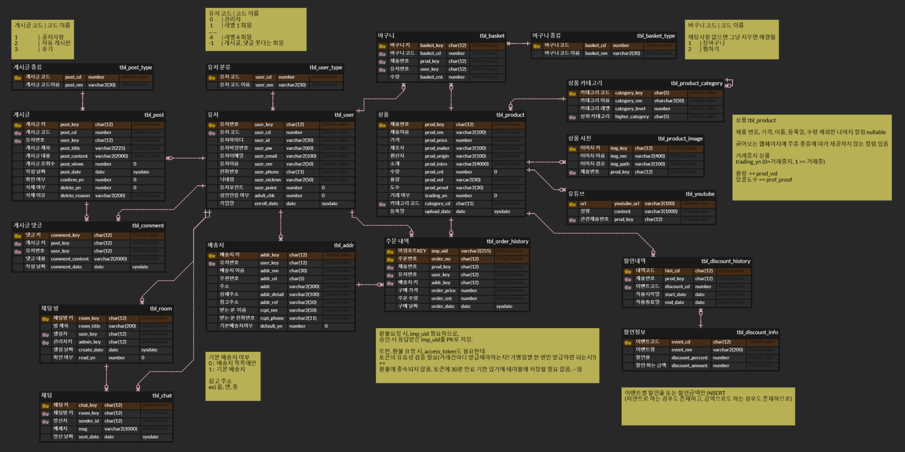

# 술주라 🍸

A full-stack Java web application built with Spring and MyBatis that allows customers to create an account (including social login), purchase premium alcoholic beverages, write product reviews, and communicate with administrators through a live chat system.

Product information is scraped from [가나주류](http://www.kajawine.kr).

## Table of Contents

- [Features](#features)
- [Tech Stack](#tech-stack)
- [ERD](#erd)
- [Development Environment](#development-environment)

---

## Features

### Customer

- Create an account (including social login)
- Browse products using category tabs and paginated product grids
- Write reviews and comments
- Chat with administrators in real time
- Purchase products using online payment

### Administrator

- Manage customer accounts
- Manage reviews and comments
- Associate YouTube videos with products
- Search and select categories when uploading new products

---

## Tech Stack

### Front-end

- JSP
- CSS
- JavaScript
- jQuery
- AJAX

### Back-end

- Java
- Spring Framework
- MyBatis
- Lombok

### Database

- Oracle Database

### Server

- Apache Tomcat

### APIs & Libraries

- [KG Inicis](https://manual.inicis.com/) - Online Payment Processing API
- [JSoup](https://jsoup.org/) - HTML Parser & Web Scraping Library
- [Socket.IO](https://socket.io/) - Real-Time Bidirectional Communication Library

---

## ERD

Designed using [ERDCloud](https://erdcloud.com).

---

## Development Environment

Follow the setup instructions in the following repositories:

- [unemotioned/spring-practice](https://github.com/unemotioned/spring-practice)
- [unemotioned/spring-mybatis-practice](https://github.com/unemotioned/spring-mybatis-practice)
